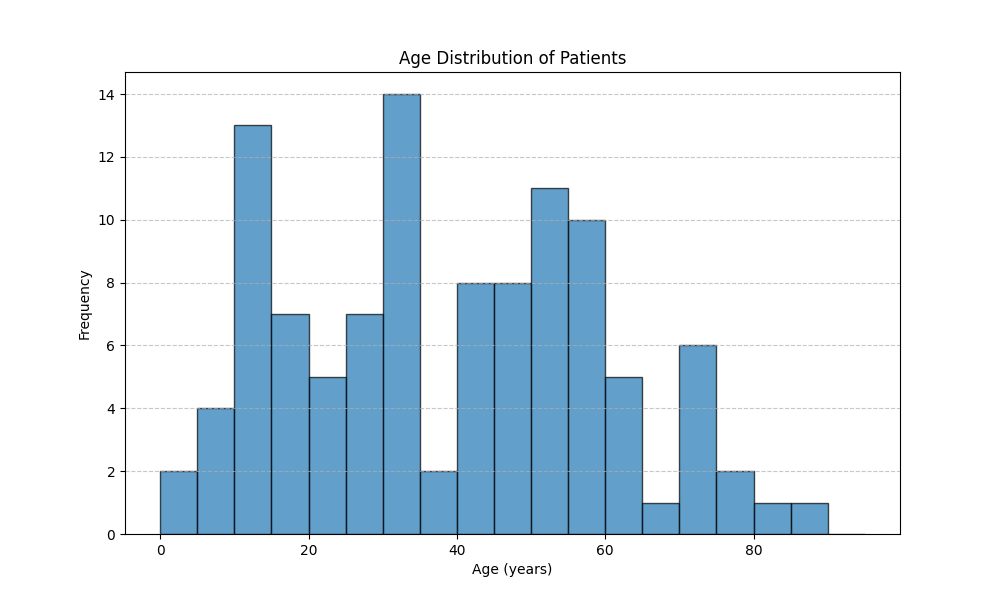

# Insights Page

[Home](./index.md) ||
[BPMN Model](./bpmn.md) ||
[Use Case Model](./use_case.md) ||
[ETL Pipeline](./etl_pipeline.md) ||
[Insights](./insights.md) ||
[Team Contributions](./team_contrib.md) ||
[About](./about.md) ||

---

## What we learned from the Project

This project has been an incredible learning experience, allowing us to explore various technologies and frameworks while building a functional ETL pipeline for the FHIR API.

### Key Learnings:
1. **Website Creation**:
   - We learned how to use GitHub Pages to host a website.
   - Configured themes and styles using `_config.yml`.
   - Created multiple Markdown files to serve as content pages for the website.

2. **Working with Python**:
   - Explored Python libraries to interact with the FHIR API.
   - Learned to write scripts for:
     - Extracting data from the OpenEMR system.
     - Transforming the data into a usable format.
     - Loading the processed data into another FHIR-compatible system.

3. **FHIR API Integration**:
   - Understood the structure of FHIR resources.
   - Successfully implemented data exchange using RESTful APIs.

4. **Collaboration and Documentation**:
   - Collaborated as a team to document each step of the process.
   - Ensured that the website serves as a comprehensive guide for the ETL pipeline.

---

### Challenges Faced
- Setting up GitHub Pages with a custom theme and ensuring proper navigation.
- Understanding the complexities of the FHIR API data format.
- Debugging Python scripts during the ETL process.

---

### Future Scope
- Automate the ETL pipeline further to handle larger datasets.
- Enhance the website's UI/UX for better accessibility.
- Integrate more advanced data transformation and validation tools.

---
** Visualization**

This histogram, created using data from OpenEMR, visualizes the distribution of patients across various age groups. The data highlights significant trends, including a high concentration of patients in the 10-20 and 40-50 age ranges, while older age groups, particularly those above 70, have comparatively fewer patients. Such demographic insights are valuable for identifying trends, understanding patient populations, and informing healthcare strategies. This visualization showcases the potential of leveraging EMR data for data-driven decision-making and improved resource allocation in healthcare.
