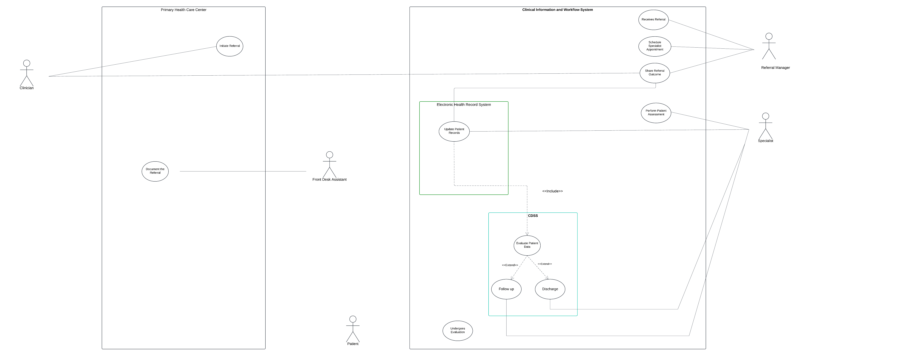

# Use Case Diagram Page

[Home](./index.md) ||
[BPMN Model](./bpmn.md) ||
[Use Case Model](./use_case.md) ||
[ETL Pipeline](./etl_pipeline.md) ||
[Insights](./insights.md) ||
[Team Contributions](./team_contrib.md) ||
[About](./about.md) ||

---

---

## Actors

The use case diagram depicts the Hospital Referral Management System that is designed to streamline the referral process and enhance patient care by integrating the Electronic Health Record (EHR) and Clinical Decision Support System (CDSS). The system brings together various actors within the Primary Care and Hospital Information Systems to streamline the referral process and ensure effective coordination of patient care across different stages. The workflow begins with the Clinician at a primary care clinic initiating a referral for a patient to a hospital for specialized care. The administrative staff ensures the referral details are documented and sent to the hospital. At the hospital, the Front Desk Assistant updates the patient’s records in the EHR system, ensuring accurate information management. The Referral Manager oversees the referral process, directing it to the appropriate Specialist and maintaining effective communication among all stakeholders to ensure the process runs smoothly. The Specialist evaluates the patient, provides treatment recommendations, and updates the system with outcomes. 

## Use Cases
The diagram highlights essential use cases within the Primary Care clinic and the Hospital Information System that enable actors to perform their respective tasks effectively such as initiating referrals, updating patient records, managing referrals, conducting patient evaluations, and utilizing the CDSS for decision-making. The CDSS analyzes the patient’s data within the EHR to assist in determining whether the patient should return to primary care for follow-up or be discharged if no further treatment is needed. Throughout this process, the Patient plays an active role by attending consultations and following prescribed treatment plans. This integrated workflow supports data-driven decision-making, efficient communication, and optimal care delivery, ensuring coordination between the hospital and primary care clinic for better patient outcomes.
